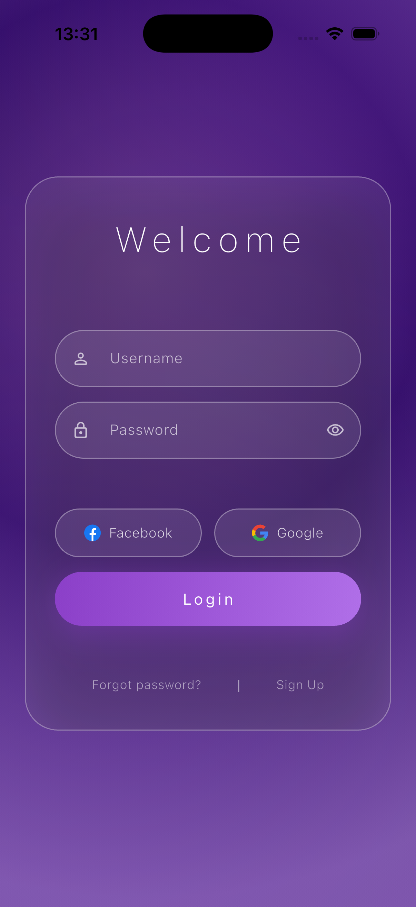

# Flutter Glass Login UI

A modern glassmorphism login screen built with Flutter.

## Preview

## Features

* Glassmorphism design
* Smooth and clean UI
* Responsive layout
* Easy to customize
* Pure frontend implementation

## How to Use

This repository is intended as a UI example.

### Option 1 (Recommended)

Replace your project's lib/main.dart with glass_login.dart to preview the UI immediately.

### Option 2

Open glass_login.dart and copy the widgets you need (such as GlassLoginPage) into your existing Flutter project, then integrate them into your app.

## Notes

This project contains only the login UI frontend. No authentication, backend, database, or API integration is included.

Built with Flutter & Dart.

If you found this project useful, consider starring the repository.
